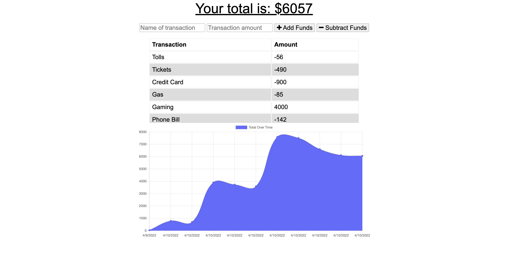

# Budget-Tracker-

## Description  

- The Budget Tracker application allows to the user to be able to track & monitor all transactions. The user will be able to add expenses and deposits to their budget with or without a connection. All changes will take effect once the users connection is online.

## Table of Contents 

* [Installation](#installation)
* [Usage](#usage)
* [Credits](#credits)
* [License](#license)

## Installation

- Node.js is needed to run application
- Install npm using command lines (npm install)
- Install mongoose (npm install mongoose)
- Install express (npm install express )

## Usage 

## License

- No licenses were used

## Contribution
- Reggie Tenkorang

## Tests

No test were performed. 
